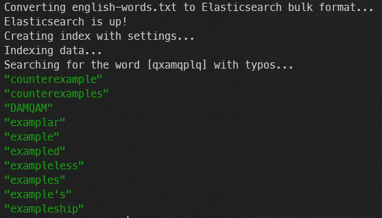

# Elasticsearch Autocomplete Demo with Docker

This project demonstrates an Elasticsearch setup with bigram and trigram analyzers, ideal for implementing advanced autocomplete and fuzzy search features. The setup is facilitated through Docker Compose, including Elasticsearch, Kibana, and a custom data import service.

## Key Components

- `docker-compose.yml`: Orchestrates the Elasticsearch, Kibana, and custom data import services.
- `Dockerfile`: Builds the custom Docker service image.
- `import_and_search.sh`: Script for importing data and executing search queries.
- `english-words.txt`: Sample dataset for the autocomplete feature.

## Elasticsearch Configuration

### Custom Analyzers and Filters

The Elasticsearch setup includes custom analyzers for bigram and trigram analysis:

- **Bigram Filter**: Creates 2-character tokens from text.
- **Trigram Filter**: Creates 3-character tokens.
- **Analyzers**: Defined using the bigram and trigram filters for enhanced text search.

### Creating the Index with Analyzers

To create the `autocomplete_index` with the necessary settings, use the following `curl` command:

```bash
curl -X PUT "localhost:9200/autocomplete_index" -H 'Content-Type: application/json' -d'
{
  "settings": {
    "analysis": {
      "filter": {
        "bigram_filter": {
          "type": "ngram",
          "min_gram": 2,
          "max_gram": 2
        },
        "trigram_filter": {
          "type": "ngram",
          "min_gram": 3,
          "max_gram": 3
        }
      },
      "analyzer": {
        "bigram": {
          "type": "custom",
          "tokenizer": "standard",
          "filter": ["lowercase", "bigram_filter"]
        },
        "trigram": {
          "type": "custom",
          "tokenizer": "standard",
          "filter": ["lowercase", "trigram_filter"]
        }
      }
    }
  }
}
'
```

### Data Import

To import data into the created index, first convert your data to the Elasticsearch bulk format, and then use the following `curl` command:

```bash
curl -X POST "localhost:9200/_bulk" -H 'Content-Type: application/json' --data-binary @bulk_data.json
```

Ensure `bulk_data.json` is in the correct format for the Elasticsearch Bulk API.

### Search Query

To perform a search query, use the following `curl` command:

```bash
curl -sS -X GET "localhost:9200/autocomplete_index/_search" -H 'Content-Type: application/json' -d'
{
  "query": {
    "bool": {
      "should": [
        {
          "match": {
            "word.bigram": "'"$SEARCH_TERM"'"
          }
        },
        {
          "match": {
            "word.trigram": "'"$SEARCH_TERM"'"
          }
        },
        {
          "match": {
            "word": {
              "query": "'"$SEARCH_TERM"'",
              "fuzziness": "AUTO"
            }
          }
        }
      ]
    }
  }
}
' | jq '.hits.hits[]._source.word'
```

## Usage

1. **Initialize Services**: Run `docker-compose up -d` to start Elasticsearch and Kibana.
2. **Execute Custom Script**: Use `docker-compose run demo` to import the data and perform a sample search query.

## Accessing Kibana

Kibana can be accessed at `http://localhost:5601` for direct interaction and visualization of Elasticsearch data.

## Result


